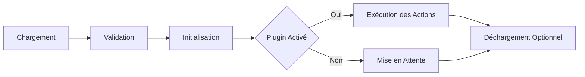

# Architecture du Système de Plugins de Deck

## Vue d'Ensemble

Le système de plugins de Deck est conçu pour être :
- Modulaire
- Extensible
- Sécurisé
- Facile à utiliser

## Concepts Clés

### 1. Interface de Plugin

Un plugin Deck implémente l'interface `Plugin` :

```typescript
interface Plugin {
  metadata: {
    id: string;
    name: string;
    version: string;
    description: string;
    requiredPermissions?: string[];
  };

  actions: {
    [actionName: string]: {
      id: string;
      name: string;
      description?: string;
      execute(context?: any): Promise<any>;
      validate?(params: any): boolean;
    }
  };

  helpers?: {
    [helperName: string]: Function;
  };

  initialize(config?: any): Promise<void>;
  unload?(): Promise<void>;
}
```

### 2. Cycle de Vie d'un Plugin



### 3. Gestion de Configuration

Chaque plugin possède un fichier de configuration par défaut :

```json
{
  "plugin-id": {
    "enabled": true,
    "settings": {
      "option1": "valeur",
      "option2": 42
    }
  }
}
```

### 4. Sécurité et Validation

- Validation stricte des configurations
- Permissions requises
- Isolation des contextes d'exécution

## Création d'un Plugin Personnalisé

### Exemple Complet

```typescript
import { Plugin } from '@deck/plugin-system';

class MaIntegrationPersonnalisee implements Plugin {
  metadata = {
    id: 'mon-integration',
    name: 'Mon Intégration Personnalisée',
    version: '1.0.0',
    description: 'Un exemple de plugin personnalisé',
    requiredPermissions: ['network', 'system']
  };

  actions = {
    executerAction: {
      id: 'action-principale',
      name: 'Action Principale',
      description: 'Réalise une action personnalisée',
      async execute(context) {
        // Logique métier
        return { success: true, details: context };
      },
      validate(params) {
        // Validation des paramètres
        return params && params.data !== undefined;
      }
    }
  };

  helpers = {
    // Méthodes utilitaires additionnelles
    verifierEtat: () => {
      // Logique de vérification
    }
  };

  async initialize(config) {
    // Configuration initiale
    if (config.enabled) {
      console.log('Plugin initialisé');
    }
  }

  async unload() {
    // Nettoyage des ressources
    console.log('Plugin déchargé');
  }
}

export default new MaIntegrationPersonnalisee();
```

## Bonnes Pratiques

### 1. Conception
- Minimiser les dépendances externes
- Gérer les erreurs de manière robuste
- Documenter clairement chaque action

### 2. Performance
- Utiliser des opérations asynchrones
- Limiter la consommation de ressources
- Implémenter des mécanismes de timeout

### 3. Sécurité
- Valider tous les inputs
- Gérer les exceptions
- Limiter les permissions

## Mécanismes Avancés

### 1. Découverte Dynamique
- Chargement automatique depuis `./plugins/`
- Validation par interface
- Configuration dynamique

### 2. Gestion des Erreurs

```typescript
class PluginError extends Error {
  constructor(
    public pluginId: string, 
    message: string, 
    public severity: 'warning' | 'critical'
  ) {
    super(message);
  }
}
```

### 3. Monitoring des Plugins

```typescript
interface PluginMetrics {
  id: string;
  name: string;
  loadTime: number;
  lastExecuted: Date;
  executionCount: number;
  errorCount: number;
}
```

## Roadmap d'Évolution

### Phase 1 : Socle Technique
- [x] Interface de plugin
- [x] Système de configuration
- [x] Gestion du cycle de vie

### Phase 2 : Extensibilité
- [ ] Marketplace de plugins
- [ ] Système de mise à jour
- [ ] Authentification des plugins

### Phase 3 : Écosystème
- [ ] SDK de développement
- [ ] Outils de débogage
- [ ] Documentation communautaire

## Contribution

1. Suivre les directives de l'interface `Plugin`
2. Écrire des tests complets
3. Documenter les fonctionnalités
4. Soumettre une pull request

## Ressources Complémentaires

- [Documentation TypeScript](https://www.typescriptlang.org/)
- [Guide de Développement de Plugins](./PLUGIN_DEVELOPMENT.md)
- [Exemple de Plugins](../plugins/)

---

*Cette architecture est un guide vivant. N'hésitez pas à proposer des améliorations.*
